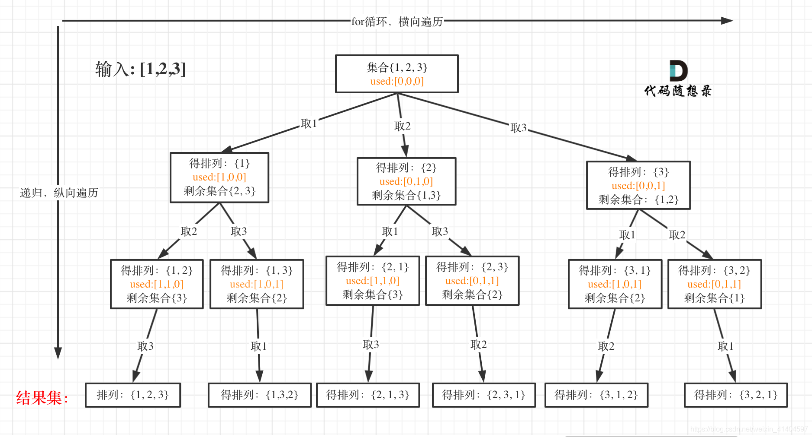
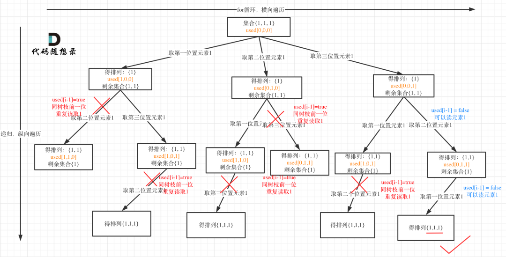

本博文写作参考程序员Carl 微信公众号（代码随想录），致谢！
- [一、回溯是什么？](#一回溯是什么)
	- [1. 回溯法能解决什么问题？](#1-回溯法能解决什么问题)
	- [2. 回溯法的模板](#2-回溯法的模板)
- [二、回溯算法的步骤](#二回溯算法的步骤)
	- [0.题目描述](#0题目描述)
	- [1.设计状态变量](#1设计状态变量)
	- [2.设定递归终止条件](#2设定递归终止条件)
	- [3.单层操作](#3单层操作)
	- [4.剪枝优化（选作）](#4剪枝优化选作)
- [三、要点分析与总结](#三要点分析与总结)
- [四、回溯算法练习题](#四回溯算法练习题)
	- [17题.电话号码的字母组合](#17题电话号码的字母组合)
	- [93题.复原IP地址](#93题复原ip地址)
	- [40.组合总和II](#40组合总和ii)
	- [90.子集II](#90子集ii)
	- [491. 递增子序列](#491-递增子序列)
	- [47.全排列II](#47全排列ii)
<hr style=" border:solid; width:100px; height:1px;" color=#000000 size=1">

回溯算法其实就是遍历穷举，时间复杂度很高。通常用于搜索一个问题所有的解，可通过深度优先遍历的思想实现。其与动态规划的区别是，动态规划通常只需要求解最优解，而回溯要遍历所有解。

# 一、回溯是什么？

**回溯法**采用试错的思想，它尝试分步地去遍历一个问题，每往前都一步，它都会将**取消上一步**的计算，以此达到遍历所有状态的目的。回溯法通常用递归来实现。反复进行上述步骤之后可能出现两种情况：

 - 找到可能存在的正确答案
 - 尝试了所有的分步方法之后，宣告该问题没有答案

> andy95: 回溯是深度优先搜索中的一种情况，而深度优先搜索的实现是用递归。所以回溯和递归并不是一个相同概念。
> Sophia_fez: 深度优先搜索是递归实现的，是要搜索整个二叉树的，在这个搜索的基础上，再加点回溯/剪枝的操作就是这一类排列组合的题了，是这个关系


## 1. 回溯法能解决什么问题？

回溯算法强调了**回退**操作对于搜索的合理性，而深度优先遍历强调的是一种**遍历**的思想。

为什么回溯法既难理解，又不高效，还要选择用它呢？

因为没得选，一些问题只能暴力搜索，撑死了再剪枝一下，没有更高效的解法。

那么是什么问题这么牛逼呢？通常来讲，回溯法用于解决如下几种问题：

- 组合问题：N个数字里边按照一定规律找出K个数的集合
- 排列问题：N个数字按照一定规则全排列，所有的排列方式
- 切割问题：一个字符串按照一定规则有几种切割方式
- 子集问题：一个N个数字的集合里有多少符合条件的子集
- 棋盘问题：N皇后，解数独

从上边可以看出，回溯法要解决的问题都是**在集合中递归地查找子集合**，所以都可以抽象为树形结构的问题。

回溯法要解决的其实就是N个for循环的问题。

## 2. 回溯法的模板
1. 回溯函数模板返回值及参数：回溯算法函数返回值一般为void
	参数由于不像二叉树递归的时候可以容易地一次性确定，一般是先写逻辑，然后根据需要添加参数。
	```cpp
	void backtracking(参数)
	```
2. 回溯函数终止条件
	既然都是树形结构，那么到叶子节点自然就要终止。
	```cpp
	if(终止条件)
	{
		存放结果；
		return;
	}
	```
3. 单步逻辑
	回溯法 = 递归过程  + 嵌套for循环
	```cpp
	for(选择：本层集合中元素（树中节点孩子的数量就是集合的大小）)
	{
		处理节点；
		backtracking(路径，选择列表)；//递归
		回溯，撤销处理结果;
	}	
	```
	


# 二、回溯算法的步骤
本文以Leetcode-46.全排列问题为例，讲解回溯算法的常见步骤。
## 0.题目描述
全排列问题$A_{n}^{n}$




- 状态变量：每一个节点，表示了求解一个问题时所处的阶段性状态
- 状态重置：搜索“回头”时，状态变量需要设置为和以前一样。在回到上一层节点的过程中，需要撤销上一次的操作。
- 状态空间：保存状态变量的栈空间，尾部添加，尾部删除。


## 1.设计状态变量

```cpp
vector<vector<int>> result;
vector<int> path;
void backtracking(vector<int>& nums, vector<bool>& used)
```
## 2.设定递归终止条件
遍历到叶子节点就是终止的地方
当收集元素的数组path的大小和nums数组一样达到时候，说明到底


```cpp
if(path.size() == nums.size())
	result.push_back(path);
	return;
```
## 3.单层操作
used数组：记录path里边有哪些元素被使用过了，一个path里一个元素只能用一次。
```cpp
for(int i=0; i<nums.size();i++)
{
	if(used[i] == true) continue;
	path.push_back(nums[i]);
	used[i] = true;
	backtracking(nums,used);
	path.pop_back();
	used[i] = false;
}
```
## 4.剪枝优化（选作）
通过剪掉明显错误的分枝，优化代码的运行时间。其实就是将上一步for循环里i的范围改小。
- 直接缩减 i 的遍历范围，倒着数可以遍历到的边界
- 通过在for循环里添加判断语句跳过某些情况
- 对于求和问题，通常先排序再在回溯过程中剪枝
<hr style=" border:solid; width:100px; height:1px;" color=#000000 size=1">

最终整体代码如下：
```cpp
class Solution{
public:
	vector<vector<int>> result;
	vector<int> path;
	void backtracking(vector<int>& nums, vector<bool>& used){
	//终止条件
	if(path.size()==nums.size())
	{
		result.push_back(path);
		return;
	}
	//单步操作
	for(int i=0;i<nums.size();i++)
	{
		if(used[i]==true) continue;
		path.push_back(nums[i]);
		used[i]=true;
		backtracking(nums,used);
		path.pop_back();
		used[i]=false;
	}
	}
	vector<vector<int>> permute(vector<int>& nums)
	{
		result.clear();
		path.clear();
		vector<bool> used(nums.size());
		backtracking(nums,used);
		return result;
	}
};
```
# 三、要点分析与总结

从过程可以看出，回溯三部曲和递归三部曲是一样的。
- 确定函数类型及返回参数
- 确定终止条件
- 单步操作逻辑

> for循环控制横向遍历
> 递归控制纵向遍历

区别好像就是
- 回溯在单步里边有撤销操作，普通递归没有。
- 回溯在单步操作里有横向for遍历，普通递归好像没吧？？
那么问题来了：
 - 递归和回溯的实质性区别到底是什么呢？
 - 如何设计函数类型及返回参数？
 - 什么时候需要回撤，什么时候不用回撤呢？
 - 递归函数什么时候要返回值，什么时候不要返回值呢？
 
 关于最后这个小问题，其实函数参数还包括两种类型，一种是void型，一种是常规数据类型（比如int）。
 但是在主函数中调用的时候，有的时候后者也不赋给任何值。
 设计常规数据类型的目的应该还是为了在迭代过程中记录中间数据。
 那么应该怎样设计void还是普通数据类型呢？
 

 # 四、回溯算法练习题

下边对leetcode上出现的经典回溯题目进行总结分析

## 17题.电话号码的字母组合

本题目的第一个难点是数据预处理

主要是需要将数字的1-9怎么映射到a-z的26字母上，我自己还想不好用什么数据结构。答案上写的是

> - 使用 map
> - 使用二维数组 string letterMap[10]

使用map的话我理解应该是把字母存成key，对应的数字存成value。
使用二维数组为什么不用vector<vector<char>>呢？
string的一维数组就相当于是char的二维数组吗
具体要怎么转化？

> 取index指向的数字，并找到对应的字符集合。然后再遍历集合。

```cpp
int digit = digits[index] - '0';        // 将index指向的数字转为int
string letters = letterMap[digit];      // 取数字对应的字符集
```
> 其中第一步的作用是取digits字符串的第index个位置的数字，目的就是确定字母。比如数字2，对应的字母就是"abc"

> 第二步的作用就是把2转换成string类型的 "abc",然后遍历"abc"

第二个难点是回溯参数，要设置index

这个index不是其他问题中的startIndex, 而是记录遍历第几个数字了，就是用来遍历digits的（？？）

同时index也表示树的深度(这个好理解，index到最大也就是digits.size()之后，说明树也到叶子节点了)

所以终止条件就是 " index == digits.size() "

第三个难点就是横向for的size是按照转换完的"abc"的size来遍历的。
其他的是按照什么来遍历的呢？肯定也是横向的一组的
- 有的是从startIndex开始，到整个字符串的size结束
- 有的要剪枝，缩小范围
- 有的是从0开始可以重复
- 本题实际上是将字母数组"2"的size替换为了单个字母对应的"abc"的size

## 93题.复原IP地址

1. startIndex设定的目的是防止重复分割，记录下一层递归分割的起始位置。那么不设置startIndex应该就是不需要防止重复。
比较特殊的参数就是pointNum，记录逗点的数量。开始怎么能想到这个参数呢？可能还是得需要做到后边才能想到吧。

2. 与第131题分割回文串不同，本题明确要求分成四段，所以不能用切割线最后的位置来确定终止条件，而是应该以分割的段数作为终止条件。

3. 这题还得单独考虑一种单断小节是否合法的判断，如果有前置0，大于255等情况出现，则认为是非法。
还有要考虑**非0-9**的字符不合法
为了方便起见，判断函数只需要输入开始截止坐标，免去先分割字串再传入参数判断的麻烦。
```cpp
isvalid(string s, int startIndex, int endIndex);
```
4. 单步循环逻辑里边需要用到截取字串的操作，和131题分割回文串一样的操作，就是通过控制for循环里边i的开始结束坐标，达到截取字串的目的。(???)

```cpp
for(int i=startIndex; i<s.size(); i++) {
	string sample=substr(s[startIndex],s[i]);
	if(!isvalid(sample))	break;
	path.push_back(sample);
	pointNum++;
	backTracking(s, startIndex, pointNum);
	path.pop_back();
	pointNum--;
}

```
从上边这段我自己写的代码，可以看出思路虽然在，但是最基础的字符串操作却不会。

> - s.insert(s.begin() + index,'.') 表示在s[i]的前边插入一个逗点
> - s.erase(s.begin() + index)		表示将s[i]删去

所以答案不是用vector<char>这种push，而是直接在字符串上增删。

另一个版本的错误代码
```cpp
void backTracking(string s, int& startIndex, int& pointNum) { //引用符号全用错
        if(pointNum == 3) {
            if(isValid(s, startIndex, s.size()-1))
                res.push_back(s);
            else
                return;
        }
        for(int i = startIndex; i < s.size(); i++) {	//这里的范围不对
            if(!isValid(s,startIndex ,startIndex+i)) break;	//范围不对
            s.insert(s.begin() + i + 1,'.');
            pointNum++;
            backTracking(s, s.begin() + i + 2, pointNum); //这里的范围不对
            pointNum--;
            s.erase(s.begin() + i + 1);
        }
    }
```
## 40.组合总和II
本题核心是回溯过程中去重，即使用过的元素不能重复选取。

去重讲解可参考[第40题组合总和II题解](https://mp.weixin.qq.com/s?__biz=MzUxNjY5NTYxNA==&mid=2247485360&idx=1&sn=2256a0f01a304d82a2b59252327f3edb&scene=21#wechat_redirect)

本题要求，元素在同一个组合内可以重复，但是两个组合不能重复。
所以我们不用管同一树枝上的重复，需要去除同一树层上的重复。

used数组用来记录同一树枝上的元素是否使用过。

当candidates[i] == candidates[i - 1]时：

- used[i - 1] == true，说明同一树支candidates[i - 1]使用过
- used[i - 1] == false，说明同一树层candidates[i - 1]使用过

对于后者for循环里就应该做continue的操作。

> 我自己写的代码里没用used数组，而是将题解中的一行代码做了改动
```cpp
if (i > 0 && candidates[i] == candidates[i - 1] && used[i - 1] == false) continue;
改为
if (i > startIndex && candidates[i] == candidates[i - 1] ) continue;
```

## 90.子集II
本题属于去重问题

组合问题可以抽象为树形结构，那么used在树上是有两个维度的，一个维度是同一树枝上使用过，另一个维度是同一树层上使用过。

去重需要先排序，不排序的话，用map或者set先记录频率，再去重，效率很低。


- 树层去重
- 树枝去重

## 491. 递增子序列
本题属于去重问题

在90题中我们是先排序，再去重。
本题是求自增子序列，不能对原数组进行排序，要不然就打乱原有的自增顺序了！
尤其是题目中的[4,6,7,7]容易误导人按照90题的排序后的思想去做。
其实应该分析[4,7,6,7]这样更一般的情况。

1. 递归函数参数 很明显一个元素不能重复使用，所以需要startIndex,调整下一层递归的起点。
2. 终止条件 
- 题目要求递增子序列的大小至少为2
- 不要加return 因为要取树上的所有节点，加了return就在每一个树枝上第一次push_back后就停止，不再遍历后边的树枝，无法到达真正的叶子节点。

## 47.全排列II

这道题目的核心是去重，首先要进行对数组元素进行排列。
返回所有不重复的全排列。
去重就涉及到used数组
> used[i-1]=true	代表同一个树枝上有重复
> used[i-1]=false	代表同一个树层上有重复

这里涉及到i是怎么循环的？

为什么used[i-1]==false和等于true都给过？

> 如果要对树层中前一位去重，就用used[i - 1] == false，如果要对树枝前一位去重用used[i - 1] == true。「对于排列问题，树层上去重和树枝上去重，都是可以的，但是树层上去重效率更高！」

树层去重：


树枝去重：


排列的话used[i]改成true之后，遍历完还要再改回成false